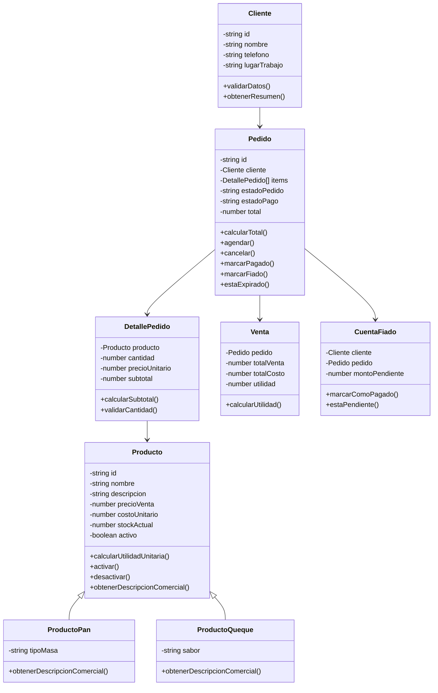

# 08 - Diseño POO

## Objetivo

Aplicar Programación Orientada a Objetos en la lógica del dominio, manteniendo el código simple y entendible.

La carpeta `domain/` debe contener clases puras sin conexión directa a Supabase ni componentes visuales.

## Principios

- Encapsulamiento.
- Responsabilidad única.
- Métodos simples.
- Validaciones dentro del dominio cuando corresponda.
- Herencia solo si aporta claridad.
- Polimorfismo solo si ayuda a ordenar productos distintos.

## Clase Cliente

Responsabilidad: representar a una persona que realiza pedidos.

Atributos:

```text
id
nombre
telefono
lugarTrabajo
createdAt
```

Métodos:

```text
validarDatos()
actualizarDatos()
obtenerResumen()
```

## Clase Producto

Responsabilidad: representar un producto vendible.

Atributos:

```text
id
nombre
descripcion
precioVenta
costoUnitario
stockActual
activo
tipoProducto
```

Métodos:

```text
calcularUtilidadUnitaria()
actualizarPrecio()
actualizarCosto()
activar()
desactivar()
validarProducto()
obtenerDescripcionComercial()
```

## Herencia de productos

Clase base:

```text
Producto
```

Subclases sugeridas:

```text
ProductoPan extends Producto
ProductoQueque extends Producto
ProductoPack extends Producto
```

No forzar herencia si la primera versión solo necesita productos simples.

## Polimorfismo

Método común:

```text
obtenerDescripcionComercial()
calcularCostoTotal()
```

Ejemplo:

- `ProductoPan` puede describir tipo de masa.
- `ProductoQueque` puede describir sabor.
- `ProductoPack` puede calcular costo sumando productos internos.

## Clase Pedido

Responsabilidad: representar el pedido de un cliente y controlar estados.

Atributos:

```text
id
cliente
items
estadoPedido
estadoPago
total
fechaPedido
fechaAgendado
fechaCierre
motivoCancelacion
```

Métodos:

```text
calcularTotal()
agendar()
cancelar(motivo)
marcarPagado()
marcarFiado()
finalizar()
validarTransicionEstado()
estaExpirado(horasExpiracion)
```

## Clase DetallePedido

Responsabilidad: representar un producto dentro del pedido.

Atributos:

```text
producto
cantidad
precioUnitario
subtotal
```

Métodos:

```text
calcularSubtotal()
validarCantidad()
```

## Clase Venta

Responsabilidad: representar una venta finalizada y calcular utilidad.

Atributos:

```text
id
pedido
totalVenta
totalCosto
utilidad
fechaVenta
```

Métodos:

```text
calcularCostoTotal()
calcularUtilidad()
generarResumen()
```

## Clase CuentaFiado

Responsabilidad: controlar un pedido fiado.

Atributos:

```text
cliente
pedido
montoPendiente
estado
fechaFiado
fechaPagoFiado
```

Métodos:

```text
marcarComoPagado()
calcularDeuda()
estaPendiente()
```

## Diagrama Mermaid


